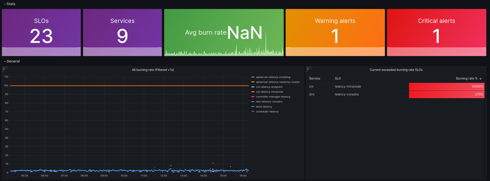

[](https://dl.circleci.com/status-badge/redirect/gh/giantswarm/sloth-app/tree/main)

# Sloth APP

This is the Giant Swarm managed app for Sloth SLO framework.

Sloth generates understandable, uniform and reliable Prometheus SLOs for any kind of service. Using a simple SLO spec that results in multiple metrics and multi window multi burn alerts.

## Visualize the SLOs

Sloth-app provides a Grafana dashboard allowing simple and quick visualization of the SLOs defined. Those dashboards are defined in the `customizations/templates` folder.

For more detailed information concerning the Sloth SLOs dashboard, check the [official documentation](https://sloth.dev/introduction/dashboards/)

### Example

Part of a `Sloth SLO dasboard` :


Part of a `Sloth SLO Overview dashboard` :


## Rule management

Sloth allow to create PrometheusRules CR as well as plain prometheus rules and can run as an operator in a Kubernetes cluster (for the PrometheusRules CR). It also provides a CLI tool for plain prometheus rules.

### Rule configuration

Sloth provides a lot of configurability concerning the rules, allowing for example the user to prevent a rule from paging by adding inhibition labels in the `alerting` section.

Sloth rule example :

```
apiVersion: sloth.slok.dev/v1
kind: PrometheusServiceLevel
metadata:
  name: kaas-phoenix-controller-manager-latency
  namespace: monitoring
  labels:
    release: prometheus
spec:
  service: "controller-manager"
  labels:
    component: "controller-manager"
  slos:
    - name: "latency"
      objective: 99
      description: Reconciliation time for each resource controlled by controller manager
      sli:
        events:
          errorQuery: |-
            clamp_min(sum(rate(workqueue_queue_duration_seconds_count{}[{{.window}}])) by (cluster_id) - sum(rate(workqueue_queue_duration_seconds_bucket{le="10"}[{{.window}}])) by (cluster_id), 0)
          totalQuery: |-
            sum(rate(workqueue_queue_duration_seconds_count{}[{{.window}}])) by (cluster_id)
      alerting:
        name: ControllerManagerReconciliationLatencyTooHigh
        labels:
          team: phoenix
          area: kaas
        annotations: {}
        pageAlert:
          labels:
            cancel_if_cluster_status_creating: "true"
            cancel_if_cluster_status_deleting: "true"
            severity: page
            team: phoenix
        ticketAlert:
          labels:
            severity: "slack"
            slack_channel: "#responsible-team"
```

## Update to the latest version

Run

```bash
bash bin/import_upstream_chart
```

## Credit

* https://github.com/slok/sloth
* https://sloth.dev
